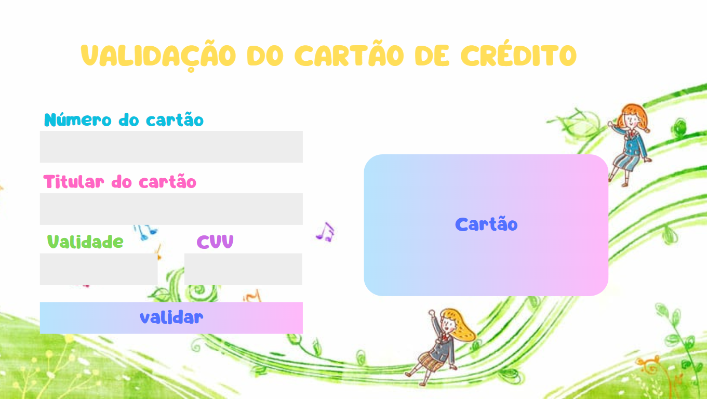
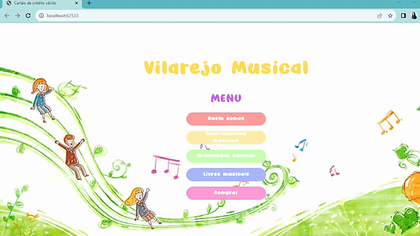

# Cartão de Crédito Válido

## Índice

* [1. Prefácil](#1-Prefácil)
* [2. Resumo do projeto](#2-resumo-do-projeto)
* [3. Sobre o tema e usuários](#3-sobre-tema-e-usuários)
* [4. Protótipo](#4-protótipo)
* [5. Interface do projeto e objetivos alcançados](#5-interface-do-projeto-e-objetivos-alcançados)
* [6. Instruções de uso](#6-instruções-de-uso)
* [7. Especificações Técnicas](#7-especificações-técnicas)
* [8. Implementações futuras](#8-implementações-futuras)
* [9. Desenvolvedora](#9-desenvolvedora)

***

## 1. Prefácio

Este projeto foi desenvolvido como parte do bootcamp da Laboratória e consiste em um projeto de nível 1 de um catálogo de projetos de complexidade crescente, associados a objetivos de aprendizagem concretos. Portanto, se trata de uma aplicação web, tendo como principal objetivo permitir ao usuário validar o número de um cartão de crédito, implementando a funcionalidade para ocultar todos os dígitos de um cartão, exceto os quatro últimos.

O projeto utilizou como método de validação o [Algoritmo de Luhn](https://en.wikipedia.org/wiki/Luhn_algorithm), que consiste em um método de soma de verificação, usado para validar números de identificação, como o IMEI de telefones celulares, cartões de crédito etc.

Esse algoritmo é simples. Primeiramente, obtemos o inverso do número a ser verificado (esse número deve conter apenas dígitos de [0-9]); Logo em seguida, todos os números que ocupam uma posição par devem ser multiplicados por dois, se após a multiplicação esse número for maior ou igual a 10, devemos somar o produto desse resultado; Na sequência devemos somar todos os números obtidos, e por fim, o número a verificar será válido se a soma de seus dígitos finais for um múltiplo de 10.

## 2. Resumo do projeto

O Card-Validation-JS é uma aplicação web que permite ao usuário validar o número de um cartão de crédito de maneira simples, eficiente e segura, objetivando a sua aplicação para a realização de compras de forma on-line.
Nessa perspectiva, foi desenvolvido um site de tema livre para que fosse possível implantar o validador de cartão de crédito para contextualização e demonstração de uso.

### Os objetivos gerais deste projeto são os seguintes

* Trabalhar com base em um boilerplate, a estrutura básica de um projeto em diferentes
  pastas (através de módulos em JS).
* Conhecer as ferramentas de manutenção e melhoria do código (linters e testes
  unitários).
* Aprenda sobre objetos, estruturas, métodos e iteração (loops) em JavaScript
* Implementar controle de versão com git (e a plataforma github)

## 3. Sobre o tema e usuários

Os principais usuários do Card-Validation-JS são empresas do ramo de venda de produtos de atacado e varejo, que desejam aumentar suas vendas utilizando a categoria on-line, permitindo aos seus clientes mais autonomia, praticidade e segurança na realização das suas compras. Uma vez que esse cliente poderá validar suas compras utilizando o validador de cartão de crédito de forma simples e segura, com a implementação do cartão virtual que permite ao usuário visualizar suas informações de maneira interativa e com a segurança da funcionalidade para ocultar todos os dígitos do cartão, exceto os quatro últimos.

## 4. Protótipo

O protótipo do projeto foi desenvolvido considerando o tema de aplicação para contextualização e demonstração de uso.
Dessa forma, as cores utilizadas foram pensadas levando em consideração a temática da aplicação que consiste em um site de instrumentos musicais voltado para pais e familiares de bebês e crianças até 5 anos, e professores de musicalização infantil (faixa etária de 0 a 5 anos). Portanto, este espaço foi pensado para despertar no usuário um sentimento de acolhimento, cuidado e carinho, contendo cores e elementos que despertam esses sentimentos.

Protótipo da tela de validação do cartão de crédito:

## 5. Interface do projeto e objetivos alcançados

A interface do projeto foi idealizada para trazer autonomia, praticidade e segurança ao usuário quanto a validação do número de cartão de crédito, para realização das suas compras de maneira on-line. Dessa forma, a aplicação do projeto foi pensada para ser demonstrada através da navegação por um site de compras, e que fosse de fácil uso, intuitiva e interativa, no qual o usuário irá preencher os dados dos campos vazios conseguindo visualizá-los de maneira imediata no cartão interativo ao lado, tendo os números do cartão mascarados, exceto os quatro últimos dígitos, para uma maior segurança, possibilitando ao usuário ter uma experiência satisfatória de uso.

Demonstração de uso:

[✔] Possui uma interface que possibilita inserir o número que desejamos validar.
        
[✔] Use apenas caracteres numéricos (dígitos) no cartão para validar [0-9].

[✔] Constatar se o resultado é válido ou não.

[✔] Ocultar todos os dígitos do número do cartão, excetuando os últimos 4 caracteres.

[✔] Não deve poder inserir um campo vazio

[✔] Testes unitários dos métodos validator (isValid e maskify).

## 6. Instruções de uso

Para usar o Card-Validator-JS, nessa aplicação de uso. O usuário terá acesso aos botões de navegação do site na primeira página. Para ter acesso ao validador de cartão de crédito o usuário deverá clicar no botão “comprar”, no qual será direcionado para uma segunda página, no qual deverá realizar o preenchimento dos dados de validação do cartão. 

Nessa página o usuário deverá preencher como campo obrigatório o número do cartão de crédito, caso esse campo não seja preenchido o usuário será impossibilitado de prosseguir com a validação do cartão. Portanto, o usuário deverá preencher os campos de “número do cartão”, “titular do cartão”, “validade” e “CVV”. Ao preencher esses campos o usuário poderá visualizar os seus dados de forma imediata no cartão interativo e também contará com a segurança em ter os números do cartão de crédito mascarados, exceto os quatro últimos dígitos. Após preencher todos os dados, o usuário deverá clicar no botão “Validar” para ter o número de cartão validado. 

Nesse momento, ele será direcionado para uma terceira página, no qual poderá visualizar a mensagem de validação ou invalidação do cartão de crédito para poder prosseguir com a confirmação da compra. Para retornar a página inicial, o usuário deverá clicar no botão “voltar ao menu” que irá direcioná-lo a primeira página, o botão “confirmar compra” é apenas ilustrativo.

## 7. Especificações Técnicas

O projeto foi desenvolvido utilizando como ferramentas e tecnologias:

* HTML
* CSS
* JavaScript
* Visual Studio Code
* Node.js
* GitBash
* GitHub

## 8. Implementações futuras

Ideias para melhorias futuras:

* Tornar todos os campos de preenchimento obrigatórios;
* Permitir ao usuário inserir apenas letras no campo “titular do cartão”;
* Permitir ao usuário inserir apenas números no campo “CVV”;
* Mostrar a franquia do cartão (por exemplo, Visa, MasterCard, etc).

## 9. Desenvolvedora

- *Jayanny Santana*: <a href="https://github.com/jay-santana"> @jay-santana</a>